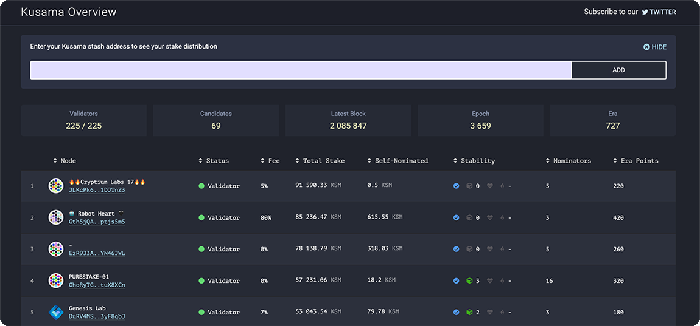

# Kusama Overview

> Validators explorer for [Kusama Network](https://kusama.network/)



## Getting Started
These instructions will get you a copy of the project up and running on your local machine for development and testing purposes.

### App structure overview

Kusama Overview app consists of three parts:
- parser-light 
- api
- ui

With `parser-light` app is continuously check for the new blocks and save reqired information to the database.
`ui` part used to display the user interface and retrieve the actual data from the database using the `api`.

### Running the application locally with Docker

##### Prerequisites
You need to have [Docker](https://www.docker.com/) and docker-compose installed on your machine to start the application.


##### Step 1: Clone this repo to your local machine and change directory
```
git clone https://github.com/genesis-lab-team/kusama-overview.git
cd kusama-overview
```

##### Step 2: Set .env configuration variables from .env.example.docker for parser, api and ui parts
```
cd parser-light && cp .env.example.docker .env
cd ../api && cp .env.example.docker .env
cd ../ui && cp .env.example.docker .env && cd ..
```

*You can edit variables in .env files if you need. For example you can replace `WSNODE=ws://polkadot-node:9944/` by `WSNODE=wss://kusama-rpc.polkadot.io/` in `parser-light/.env` if you want to use remote public node instead of the local one*

<details>
<summary>See the full list of .env variables</summary>

`parser-light/.env`
Variable | Default value | Description
 ------ | ------ | ------
WSNODE | ws://polkadot-node:9944/ | Polkadot node RPC endpoint
APP_API_PORT | 4002 | Kusama Overview app API port
DB_NAME | kusama-overview | Database name
DB_LOCATION | localhost | MongoDB host
DB_PORT | 27017 | MongoDB port


`api/.env`
Variable | Default value | Description
 ------ | ------ | ------
APP_API_PORT | 4002 | Kusama Overview app API port
DB_NAME | kusama-overview | Database name
DB_LOCATION | localhost | MongoDB host
DB_PORT | 27017 | MongoDB port


`ui/.env`
Variable | Default value | Description
 ------ | ------ | ------
VUE_APP_API_PORT | 4002 | Kusama Overview app API port
</details>

##### Step 3: Start the application with docker-compose
```
docker-compose up
```

*If you want to use remote polkadot node instead of the local one you can start only app and mongo containers with `docker-compose up mongo kusama-overview-app` command*

*You can see the application running by visiting http://127.0.0.1:3002 url in your browser*

### How to update the app to the latest version

##### Step 1: Pull the latest code from this repository
```
git pull
```

##### Step 2: Remove old docker data
```
docker-compose down
```

##### Step 3: Get latest containers from Docker Hub
```
docker-compose pull
```

##### Step 4: Rebuild and start the new version
```
docker-compose up --build
```


### Manual installation

##### Prerequisites

If you want to use the app without Docker you need to setup next tools first:
- [MongoDB](https://www.mongodb.com/)
- [Node.js](https://nodejs.org)
- [Polkadot Node](https://github.com/paritytech/polkadot)

##### Step 1: Clone this repo to your local machine and change directory

```
git clone https://github.com/genesis-lab-team/kusama-overview.git
cd kusama-overview
```

##### Step 2: Install dependencies
```
npm ci
cd parser-light && npm ci
cd ../api && npm ci
cd ../ui && npm ci && cd ..
```

##### Step 3: Set .env configuration variables from .env.example for parser, api and ui parts
```
cd parser-light && cp .env.example .env
cd ../api && cp .env.example .env
cd ../ui && cp .env.example .env && cd ..
```
*You can edit variables in .env files if you need. For example you can replace `WSNODE=ws://localhost:9944/` by `WSNODE=wss://kusama-rpc.polkadot.io/` in `parser-light/.env` if you want to use remote public node instead of the local one*

<details>
<summary>See the full list of .env variables</summary>
 
`parser-light/.env`
Variable | Default value | Description
 ------ | ------ | ------
WSNODE | ws://localhost:9944/ | Polkadot node RPC endpoint
APP_API_PORT | 4002 | Kusama Overview app API port
DB_NAME | kusama-overview | Database name
DB_LOCATION | localhost | MongoDB host
DB_PORT | 27017 | MongoDB port


`api/.env`
Variable | Default value | Description
 ------ | ------ | ------
APP_API_PORT | 4002 | Kusama Overview app API port
DB_NAME | kusama-overview | Database name
DB_LOCATION | localhost | MongoDB host
DB_PORT | 27017 | MongoDB port


`ui/.env`
Variable | Default value | Description
 ------ | ------ | ------
VUE_APP_API_PORT | 4002 | Kusama Overview app API port
</details>

##### Step 4: Start the application in development mode
```
npm run development
```
*You can see the application running by visiting http://127.0.0.1:3002 url in your browser*

### How to update the app to the latest version

##### Step 1: Pull the latest code from this repository
```
git pull
```

##### Step 2: Update dependencies
```
npm ci
cd parser-light && npm ci
cd ../api && npm ci
cd ../ui && npm ci && cd ..
```

##### Step 3: Start the app
```
npm run development
```

### Ready to deploy on production?
Add `-f docker-compose.production.yml` to every docker-compose command
